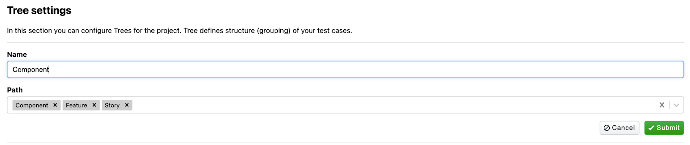
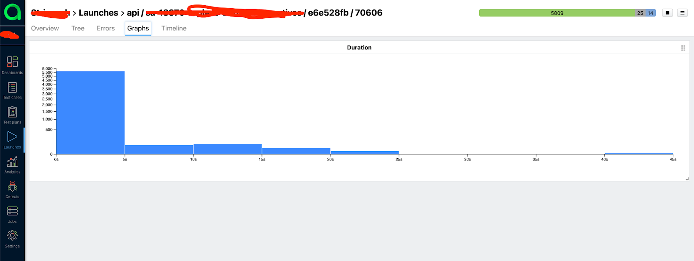
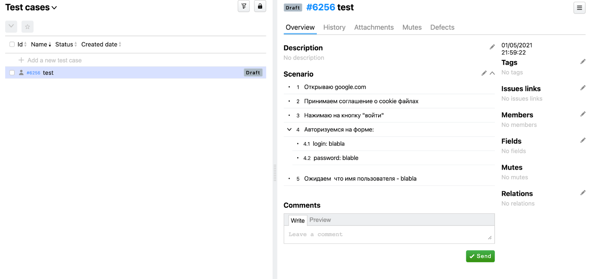

# Allure. В поисках тихой гавани.

* [Введение](#Введение)
* [А что было до](#А-что-было-до)
    * [Попытка номер раз](#Попытка-номер-раз)
    * [Попытка номер два](#Попытка-номер-два)
    * [Попытка номер три](#Попытка-номер-три)
* [Первая интеграция и первые результаты](#Первая-интеграция-и-первые-результаты)
* [Разочарование](#Разочарование)
* [Доработка напильником](#Доработка-напильником)
* [Финишная прямая](#Финишная-прямая)
* [Где ручные кейсы, Карл?](#Где-ручные-кейсы,-Карл?)
* [Dashboards and reports](#Dashboards-and-reports)
* [Заключение и планы на будущее](#Заключение-и-планы-на-будущее)


## Введение


Приветствую тебя, мой виртуальный друг!
Если ты читаешь эту статью, скорее всего тебе интересен Allure, или ты хочешь разобраться с тем, что это за зверь и как
он интегрируется в тестирование без многонедельных плясок с бубном.

В этой статье хочу рассказать о том, как мы внедряли один из инструментов, который помогает (или пытается)
сделать жизнь инженерам по обеспечению качества продукта немножечко легче:
постараюсь рассказать в деталях с чего все начиналось, как шло внедрение, через что прошла команда, что в итоге получили
и куда планируем двигаться дальше.

А виновником появления этой статьи, как нетрудно догадаться, стал тот самый инструмент — бывший Allure EE, Allure Server
и нынешний [Allure Testops](https://qameta.io/).

## А что было до?

Несколько лет назад я присоединился к одному очень интересному и амбициозному проекту. В команде было шесть
разработчиков и два QA-инженера, включая меня. На тот момент тестовым стеком, который уже был внедрен и использовался в
компании, оказался:

* php7.4 и framework [Codeception](http://codeception.com/),
* Framework [Selenoid](https://aerokube.com/selenoid/latest/) для управления браузерами
* В качестве CI/CD системы мы использовали [Gitlab](http://gitlab.com/).
* Отдельной системы генерации отчетов как такой не было: для авто тестов мы использовали встроенный в codeception
  простой генератор отчетов (включается при передаче флага
  [--html](https://codeception.com/docs/12-ContinuousIntegration#HTML-Reports) при запуске самих тестов), а для ручных
  тестов, мы
  использовали [TMS Zephyr](https://marketplace.atlassian.com/apps/1014681/zephyr-squad-test-management-for-jira?hosting=cloud&tab=overview)
  .

Соответственно приходилось смотреть два разных отчета и делать сопоставление между ручными и автотестами, что, сами
понимаете, не очень-то удобно. Кроме неудобства в репортинге, постоянно возникали вопросы вроде “А как же скрестить ежа
с попугаем?” Ладно, шучу! “А как же получить отчет в котором будет наглядный список автоматических и ручных тестов?” или
“как же получить отчет в котором будет четко показано, что проверяют уже написанные автотесты?” Ответы на эти вопросы
очень затягивались и в итоге сам стек для автотестов на тот период времени было принято не менять по причинам плотной
интеграции и существующей базы автотестов, но вот касаемо отчетов и полноценной report-системы решили, что пришла пора
переменам.

## Попытка номер раз

Главным преимуществом системы, которая изначально была у нас в стеке, напомню, это был Zephyr, была глубокая интеграция
с JIRA. Интеграция позволяла вести всю тестовую документацию прямо не выходя из нее, настраивать дэшборды, используя
JQL, писать тест кейсы прямо в таске и интегрировать их в “борду”.

Впрочем, были и минусы. Во-первых, очень сложно и неудобно писать/редактировать тесты в маленьком окошке
(да-да, оно умеет настраиваться по размеру, но все равно неудобно, особенно при большом объеме документации). Во-вторых,
мы не смогли найти ответ, как слинковать автотесты c ручными и настроить сквозные отчеты для нашей тестовой
инфраструктуры. Эти недостатки и отправили нас в путешествие в надежде найти тихую гавань, в которой можно заниматься
тестированием и качеством продукта, а не постоянной рутиной по сборке и допиливанию отчетов. Мы отправились искать
другой инструмент.

## Попытка номер два

Вторым заходом в бухту стал всем известный [TestRail](https://www.gurock.com/testrail/). При первом знакомстве с ним я
был в восторге!
В одном месте можно удобно хранить тесты, тест планы, делать прогоны ваших тестов и показывать красивые отчеты:
тут и история создания тест-кейсов есть, и удобное редактируемое поле для шагов в самом тест-кейсе. Но и без ложки дегтя
не обошлось — как с автотестами подружить отчеты и сделать единые прогоны? Да, у TestRail
есть [API-документация](https://www.gurock.com/testrail/docs/api/getting-started/binding-php), которую мы использовали и
даже реализовали свою [версию](https://github.com/fr05t1k/testrail) (за что отдельное спасибо команде разработчиков,
которая нам помогала в этом) интеграции с запуском и проставлением статусов у каждого теста. Просто в определенный
момент пришло осознание, что мы уделяем интеграции и ее настройке уйму времени, а конечного результата на горизонте все
еще нет. Тихой гавани не было видно, поэтому переезд номер три был не загорами.

## Попытка номер три

В этот раз у нас не было права на ошибку и мы занялись серьезной подготовкой к выбору следующего инструмента:
долгий поиск в интернете, советы с коллегами, жаркие дискуссии и чтение книг, — все это привело нашу команду на одну
из [конференций](https://qa.cyprusitforum.com/en) по тестированию, на которой выступал Артем Ерошенко. Доклад был
посвящен тому самому Allure EE, что это за инструмент, что он умеет и как это готовить. Впечатлившись выступлением, я
пошел разбираться, будет ли все это ~~безобразие~~ работать со стеком на нашем проекте.

```text
Здесь стоит сделать отступление, что наша команда уже запланировала переезд на другой тестовый стек и 
мы плотно над этим работаем, но об этом в другой раз.
```

Как выяснилось при внедрении — это оказалось одной из самых больших проблем, с которыми пришлось столкнуться. На момент
нашего знакомства с Allure EE была реализована только часть функций, а адаптер для PHP был сыроват. Несмотря на эти
недочеты, уже реализованная функциональность почти полностью покрывала наши требования, и, по сравнению с другими
инструментами, которые мы пробовали, это был глоток свежего воздуха. Снимаемся с якоря, первые попытки интеграции не
заставят долго ждать.

## Первая интеграция и первые результаты

Пятница, поздний вечер… Всей командой сидим на работе? Какого ***?

Ответ прост — мы получили триальный ключик Allure TestOps! Развернув само приложение на отдельном сервере через образы
[docker-compose](https://docs.qameta.io/allure-testops/deploy/compose/#configuration), мы наконец-то увидели форму
авторизации, залогинившись в которой, получили пустой проект и полное осознание того, что впереди еще долгий путь.


Всю тестовую инфраструктуру надо поднимать и настраивать почти что с нуля, а потом еще и показать коллегам, как это
будет работать. Понеслась!

Создали проект в UI, добавили в composer новую зависимость, создали ветку, пушнули, иии... магии нет :)
Что же, придется почитать документацию и выяснить неочевидный факт — отчет надо загружать через
[allurectl](https://docs.qameta.io/allure-testops/integration/import-gitlab/).

С подключением зависимости в composer и описанием yaml-файла проблем не возникло, в репозитории
есть [пример](https://github.com/allure-framework/allure-codeception), а вот как отчет грузить, это прям вопрос? Как я
писал выше, у нас используется gilLab в качестве CI/CD системы и определенная пачка тестов бегает в docker контейнерах,
а часть тестов — на тестовых стендах. Хорошо... Пытаемся интегрировать allurectl в docker и подружить его с gitlab-ом.

Создаем dockerfile, указываем путь к репозиторию [allurectl](https://github.com/allure-framework/allurectl) и делаем
этот файл исполняемым.

* Пример запуска скрипта allurectl:

```text
FROM docker/compose:alpine-1.25.5

RUN apk add \
   bash \
   git \
   gettext

ADD https://github.com/allure-framework/allurectl/releases/latest/download/allurectl_linux_386 /bin/allurectl

RUN chmod +x /bin/allurectl
```

Уже лучше, дальше описываем логику работы с пайплайном и запускаем скрипт (allurectl) после прохождения тестов на CI.
Для того чтобы в Allure Testops узнал про наши тесты, нужно описать работу двух джоб:
`allure-start` и `allure-stop`.

* Пример реализации джобы `allure-start`:

```text 
allure-start:
 stage: build
 image: ваш образ
 interruptible: true
 variables:
   GIT_STRATEGY: none
 tags:
   - ваши теги
 script:
   - allurectl job-run start --launch-name "${CI_PROJECT_NAME} / ${CI_COMMIT_BRANCH} / ${CI_COMMIT_SHORT_SHA} / ${CI_PIPELINE_ID}" || true
 rules:
   - if: если нужны какие правила для запуска и ниже условия
     when: never
   - when: always
 needs: []
 ```

* А allure-stop — так:

```text
allure-stop:
 stage: test-success-notification
 image: ваш образ
 interruptible: true
 variables:
   GIT_STRATEGY: none
 tags:
   - ваши теги
 script:
   - ALLURE_JOB_RUN_ID=$(allurectl launch list -p "${ALLURE_PROJECT_ID}" --no-header | grep "${CI_PIPELINE_ID}" | cut -d' ' -f1 || true)
   - echo "ALLURE_JOB_RUN_ID=${ALLURE_JOB_RUN_ID}"
   - allurectl job-run stop --project-id ${ALLURE_PROJECT_ID} ${ALLURE_JOB_RUN_ID} || true
 needs:
   - job: allure-start
     artifacts: false
   - job: acceptance
     artifacts: false
 rules:
   - if: $CI_COMMIT_REF_NAME == "master"
     when: never
 ```

Тут стоит добавить, что Allure TestOps создает папку allure-results в папке `{имя вашего проекта}/tests/_output`
которую формирует сам framework (в нашем случае codeception). И все что нужно сделать — загрузить артефакты,
сформированные после прогона тестов в Allure через консольную команду `allurectl`.

```text
.after_script: &after_script
 - echo -e "\e[41mShow Artifacts:\e[0m"
 - ls -1 ${CI_PROJECT_DIR}/docker/output/
 - allurectl upload ${CI_PROJECT_DIR}/docker/output/allure-results || true
```

* Для нотификаций в Slack:

Чтобы отправлять нотификации к примеру об упавших тестах, достаточно передать launch id. Grep-нуть его можно примерно
так:

```text
if [[ ${exit_code} -ne 0 ]]; then
 # Get Allure launch id for message link
 ALLURE_JOB_RUN_ID=$(allurectl launch list -p "${ALLURE_PROJECT_ID}" --no-header | grep "${CI_PIPELINE_ID}" | cut -d' ' -f1 || true)
 export ALLURE_JOB_RUN_ID
```

Вот так это может выглядеть у вас в Slack:


В итоге получаем результат — тесты начинают бегать в docker, используя локальное окружение. При этом запускается джоба
allure-start. Как только allure-start пробежала в самом Allure, создается заглушка, в которую будут загружены тесты
после их исполнения. Вот так может выглядеть пайплайн:


* Пример `acceptance.yaml` файла.

Тут достаточно подключить allure-ee как extensions и указать настройки конфигурации. Кстати, если у вас есть тесты c
аннотацией @skip — добавьте эту строчку в конфиг, в противном случае будет ошибка.

```yml
extensions:
  enabled:
    - Yandex\Allure\Codeception\AllureCodeception
  config:
    Yandex\Allure\Codeception\AllureCodeception:
      deletePreviousResults: false
      outputDirectory: allure-results
      ignoredAnnotations:
        - env
        - dataprovider
        - skip
```

Итак, первый шаг интеграции готов. Смотрим первые результаты и пытаемся понять, что в итоге загрузилось в Allure? Есть
тесты с шагами и бублик с разными статусами. Значит, запуск тестов на каждой ветке и конкретном sha-ref (коммите)
работает, а еще на каждый коммит и создание ветки запускается набор тестов, который по итогам выполнения отправляет
результаты в Allure. Allure в свою очередь рисует бублик со статусами выполненных тестов. Успех и маленькая победа!

На этом вечерние посиделки в пятницу были завершены, и мы с радостными мыслями удалились в бар по домам :).

## Разочарование

Итак, тесты успешно бегают на бранчах и для каждого sha-ref (коммита) — восторгу нет предела. Впрочем, как известно,
эйфория проходит быстро. Именно так и случилось. Мы полезли смотреть на дерево автотестов (к тому моменты они уже
успешно бегали в Gitlab) и обнаружили совершенно нечитаемую историю, по которой никак нельзя понять, что в ней
проверяется. В этот момент пришло горькое осознание, что мы сделали шаг вперед и два назад.

* Примерно так выглядел результат после успешной загрузки xml-отчета в Allure:
  
  Само дерево строится по принципу `название тестового метода + data set #1
  (если он есть в тесте)`.

* Шаги в тестах выглядят примерно так:
  
  Из этих шагов, естественно, ничего не понятно: что за `get web driver`, что за `get helper`; зачем мы перезагружаем
  страницу и т.д., — если такие отчеты увидит кто-то из руководства, вопросов будет больше, чем шагов в тесте.

И сейчас вы наверняка думаете, что я расскажу, как в два клика мы победили эту "неувязочку" ? Нет!

Тут начинается боль… Боль инженера по обеспечению качества. Ребята из Qameta предлагают решить эту проблему при помощи
аннотаций к тестам: определить, где у нас features, где story, а где component и для каждого теста выставить аннотации
над методом. Такая разметка позволяет динамически строить красивое дерево.

А что насчет шагов? Аннотировать каждый? Для этого тоже есть решение, которое заключается в создании обертки для каждого
метода. Эта обертка будет служить красивым и понятным именем для метода и шага. В целом предложения и подход здравые, но
когда на проекте n^8-тестов, этот процесс может затянуться. По сути, разметка тестов для Allure требует практически
полного рефакторинга всего, что есть в проекте! Очень много времени.

Также к минусам можно отнести отсутствие валидации этих аннотаций. Если вполне естественным образом пропустить опечатку
в аннотациях, забыть закрыть кавычки или неправильно закрыть фигурные скобки, тест просто упадет со всеми вытекающими
последствиями. Особенно болезненно будет тем, кто в проекте недавно и не очень хорошо представляет себе структуру
тестового набора, и тем, кто занимается ручным тестированием и сильно далек от мира автоматизации.

P/s. В качестве решения валидации аннотаций, можно посоветовать установить плагин для
phpStoprm [PHP Annotations](https://plugins.jetbrains.com/plugin/7320-php-annotations), который поможет найти подобные
ошибки, но конечно же не все.

## Доработка напильником

Ну что, дорогие читатели, напильник в руки и начинаем полировать заготовку! Добавляем аннотации к автотестам, по пути
рефакторим код тестов, а так же согласуем с аналитиками и ВСЕМИ участниками вашей команды будущую структуру вашего
дерева. Давайте посмотрим на то как это может быть выглядеть в коде на примере одного автотеста:

```phpdoc
/**
     * @Title("Название вашего теста - короткое")
     * @Description("Пишем подробное описание")
     * @Features({"А что за фича собственно?"})
     * @Stories({"Ну про сторю не забываем!"})
     * @Issue({А где требования Карл?})
     * @Labels({
     *     @Label(name = "Jira", values = "SA-1111"),
     *     @Label(name = "component", values = "Наш компонет"),
     *     @Label(name = "layer", values = "the layer of testing architecture - вспоминаем мат часть"),
     * })
```

То, что вы видите на скриншоте, это адаптированный
[стандарт документирования Javadoc](https://ru.wikipedia.org/wiki/%D0%93%D0%B5%D0%BD%D0%B5%D1%80%D0%B0%D1%82%D0%BE%D1%80_%D0%B4%D0%BE%D0%BA%D1%83%D0%BC%D0%B5%D0%BD%D1%82%D0%B0%D1%86%D0%B8%D0%B8)
для PHP. Теперь посмотрим, как это выглядит в Allure Testops:


На скриншоте видно, что тесты выстроены в структуре, а именно: Component -> Feature -> Story. Это предварительно
настраивается в самом Allure TestOps.


В любой момент структуру можно отредактировать и дерево пересоберется в соответствии с запросом. Теперь пора навести
порядок с шагами в автотестах. Можно использовать
метод [executeStep](https://github.com/allure-framework/allure-php-commons/blob/master/src/Yandex/Allure/Adapter/Support/StepSupport.php)
как надстройку и красивое описание для нашего метода. В нашем примере в сигнатуру метода первым параметром передаем
текст, который будет отображаться как `human readable step` в UI Allure для метода `addInvite` (пример реализации):

```php
public function createInviteCode(User $user, string $scheme): Invite
{
   return $this->executeStep(
       'Create invite code for ' . $user->username . ' with ' . $scheme,
       function () use ($user, $scheme) {
           return $this->getHelper()->addInvite(['user' => $user, 'schemeType' => $scheme]);
       }
   );
}
```

Таким образом, вся внутренняя реализация скрывается под капотом, а шаги в тестах "естественным" образом получают
красивые и понятные названия. В итоге тестовый сценарий в Allure выглядит примерно вот так:


Важно отметить, что такой рефакторинг занял у команды примерно месяц интенсивной и упорной работы: приходилось даже
засиживаться допоздна в надежде, что еще чуть-чуть и финишная прямая...

## Финишная прямая

Подведем некий итог, что же в итоге получилось? Напомню, что изначальной задачей было приведение всего набора автотестов
в порядок, чтобы их можно было спокойно читать и использовать, не забыв при этом про ручные тесты. В нашем случае, на
создание разработчиком pull-request в Gitlab создается ветка с названием и sha-ref коммита и заводится пайплайн, в
котором запускаются тесты. Так вот, мы хотели понимать, какие тесты запускались каждой из веток или каждом из коммитов.

Настроив интеграцию, мы получили отдельную страницу со всеми запусками (Launches) в Allure TestOps. Страница Launches
показывает эту информацию в структурированном виде, позволяет отфильтровать ее и получить нужный срез данных (запущенные
тесты, процент успешно выполненных и упавших тестов и другую схожую информацию) по конкретной ветке.


Если провалиться в конкретный Launch, можно посмотреть на структуру нашего проекта: какие есть компоненты, какие фичи,
сколько было перезапусков и какие именно тесты перезапускались, информацию о дереве тест-кейсов, график, который
показывает сколько времени бежал самый долгий тест,


график с длительностью тестов, — и в конце концов экспортировать этот прогон в JIRA-тикет.


Отдельно хочется упомянуть про политики для Live documentation, которая в автоматическом режиме обновляет дерево
тест-кейсов по правилам и триггерам, например, только из ветки мастер.


Работает это так: у нас есть автотест, в котором изменили пару шагов и поправили аннотации. Этот тест запускается и
выполняется с набором тестов на мастере (на пулл-реквест в мастер), после чего можно либо вручную закрыть launch, либо
дождаться, когда launch будет закрыт по cron’у, который настраивается в интерфейсе Allure. При закрытии запуска старый
автотест обновляется — получаем актуальный тест-кейс. Это позволяет в принципе забыть про актуализацию тестовой
документации в интерфейсе.

## Где ручные кейсы, Карл?


Итак, стало понятно, что и где тестируется, какие тесты выполняются, как часто перезапускаются и какие дают результаты
по итогам прогонов. Кажется, все! или нет? Ах да! Мы забыли про ручные кейсы.

Давайте чуть разберемся в структуре тест-кейсов, которую нам предлагает следовать Allure TestOps — она предполагает, что
тест представляет из себя законченный сценарий, а expected result является необязательным элементом теста. А там, где
это необходимо, можно описывать “expected result” в виде вложенных шагов. Написав пару-тройку тест-кейсов в таком стиле,
становится ясно, что это удобно и практично. Пример такого теста может выглядеть так:


Если такой стиль написания кейсов не устраивает по какой-либо причине, всегда можно включить `другую` структуру с
предусловиями.


Далее мы импортировали ручные тест кейсы из TestRail в Allure TestOps. Механизм импорта тест-кейсов позволяет гибко
настроить, что именно импортировать, а что нет, поэтому проблемы были только с самими тестами — много ручных тестов
снова пришлось переработать под новую структуру. Думаете, все? Как бы не так!

В конечном итоге мы получили базу с ручными и автоматическими тестами в едином месте и были готовы презентовать
результаты работы коллегам, но что-то пошло не так и обнаружилась еще одна неприятная история. Перед той самой
презентацией мы решили настроить все отчеты, фильтры, показать, какие у нас есть ручные тест-кейсы, какие
автоматические, как все это прекрасно работает, но, немного перемудрив с настройками Allure TestOps, мы окончательно
запутались в нашем дереве и с трудом стали различать, где ручной, а где автоматический тест. Почему так произошло?

Потому что мы попытались интегрировать ручные тесты в структуру автоматических тестов. Впрочем, проблема оказалась не
фундаментальной, а технической: поскольку структура для автоматических тестов была написана с помощью аннотаций в коде,
а ручные тесты создавались/редактировались прямо в интерфейсе Allure, после закрытия каждого прогона с `мастер`
ветки начиналась путаница в статусах всех тест-кейсов.

Выглядело это примерно так:


Осознав, где свернули не туда, мы решили удалить текущее дерево и все настроить заново. С автоматическими тестами
проблем не возникло, они очень быстро обновили документацию и выстроились в новое дерево на основе аннотаций. Но один
важный вопрос остался открытым: что же делать с ручными тестами? Если пойти тем же путем, что и в прошлый раз, получим
инструмент который решает задачи связанные только с автоматизацией, оставим TestRail для ручных тестов и продолжим
связывать вручную два разрозненных отчета, как в старые добрые времена.

Решение нашлось неожиданно: как-то вечером перед [Гейзенбагом](https://heisenbug.ru/), одной из самых больших
конференций по тестированию, я просматривал программу прошлых докладов и обнаружил доклад на тему
[Тест-кейсы как код](https://www.youtube.com/watch?v=Prm2-c_5mYs). Да, практика не новая, и про нее многие слышали. Ее
суть заключается в том, что даже ручные тесты следует писать как метод под будущую автоматизацию:
создали тестовый метод, в нем описали сценарий, сделали ветку, сделали merge request, прислали коллегам на ревью. Если
коллегам что-то не понравилось в mr, они оставляют комментарий, вы правите, после чего ветка успешно мержится в
основную. Что характерно, все это можно делать прямо в вашей CI (напомню, что в нашем случае это gitlab).

Отличная практика, но как ее подружить c Allure и получить вменяемые отчеты? На помощь снова приходят аннотации. Пишем
ручной тест в нужном месте в репозитории, размечаем его с помощью аннотаций, созданных для автотестов, после чего
указываем, что тест — ручной. Примерно так:

```phpdoc
* @Title("Короткое описание")
* @Description("Чуть понятнее пытаемся расписать")
* @Features({"Наша фича к которой относится тест кейс"})
* @Stories({"Если нужна"})
* @Issues({"Ссылка на требования, к примеру conf"})
* @Labels({
*     @Label(name = "Jira", values = "Номер jira тикета"),
*     @Label(name = "component", values = "Компонент"),
*     @Label(name = "createdBy", values = "автор тест кейса"),
*     @Label(name = "ALLURE_MANUAL", values = "true"),
* })
```

Шаги теста могут выглядеть таким образом:


Метод step в данном случае так же как и в случае с автотестами является просто оберткой над встроенным методом Allure
executeStep. Единственное отличие в том, что для такого теста добавляется Label = ALLURE_MANUAL. А так это выглядит в
Allure:


Стоит отметить, что сами тесты после запуска прогона на ветке получают статус: in_progress, что достаточно удобно, когда
в отчете есть ручные и автоматические тесты. Это означает, что их нужно пройти вручную. Вообще, Allure умеет назначать
тесты на тестировщиков, если вы пропишете правила в настройках запуска. Так же для более удобной работы с такими
тестами, есть плагин [Allure TestOps Support](https://plugins.jetbrains.com/plugin/12513-allure-testops-support),
который позволяет удобно выгружать результаты прогонов как ручных так и авто тестов в Allure Testops прямо не выходя из
IDE.

Таким образом, мы получаем ручные тест-кейсы, которые хранятся в коде, имеют версионированность, подробную информацию об
авторе тест-кейса, ссылки на все имеющиеся требования и ручной статус в Allure. Кроме того, такой тест автоматически
становится готов к дальнейшей автоматизации. А самое главное, что теперь можно не бояться что-то потерять или удалить,
так как все тесты могут очень быстро воссоздать прежнюю структуру после прогона.

Да, при этом редактировать и убираться в репозитории приходится чаще, а подходить к созданию тест-кейсов нужно более
ответственно. Лично мне почему-то такой подход ближе. Возможно потому, что он избавляет нас от бездумных тест-кейсов в
стиле "проверяю то, сам не знаю что", но это мое личное мнение. Теперь о глобальных минусах. Если нужно что-то
прикрепить (картинку или файл) к тест-кейсу, сделать это будет довольно сложно, так как в Allure TestOps эта возможность
реализована не для всех языков. Для PHP, это пока что в стадии доработки.

Еще один минус заключается в том, что такие ручные тесты постоянно запускаются с автотестами и потребляют драгоценное
время при прогоне всего набора тестов. Конечно время выполнения такого теста очень маленькое, но это может оттолкнуть от
идеи использовать такой подход.

Одно могу точно сказать: ребята из Allure EE сейчас активно работают в этом направлении и я думаю, что со временем
предложат более элегантное решение этого вопроса. Как несложно догадаться, наша команда получила то, чего желала, и пока
что остается на этом пути. 

Dashboards and reports Что ж, с ручными тестами вроде разобрались, перенесли часть тестов в
код, часть удалили, часть по пути автоматизировали, а некоторые тесты вообще расписали как документацию в Confluence,
получив внутреннюю базу знаний. Осталось разобраться с отчетами. В Allure TestOps для этого есть отдельная страница,
которая так и называется — dashboards. Она представляет из себя набор маленьких дэшбордов и виджетов, на которых можно
найти информацию обо всех тестах, их количестве, запусках (launches) и статистике исполнения.


На виджете “test cases” видно общее количество наших тестов, как ручных, так и автоматических. На виджете “launches”
видны запуски и количество тестов, которые были запущены в каждом из них. Если этой информации покажется недостаточно,
можно настроить свои виджеты с помощью встроенного query language (аналог языка в JIRA) и сделать практически любой
отчет. К примеру мне очень понравилась идея с отчетом, который называется “Test Case Tree Map Chart”, показывающий
матрицу покрытия.


Представьте себе единый график, на котором можно посмотреть, что для одной фичи у нас 3 ручных и 1 автотест, а для
другой — только 5 ручных тестов. Такой график легко позволяет понять, где хромает автоматизация или тестовое покрытие в
принципе.

## Заключение и планы на будущее

Интеграция на этом этапе была завершена и то, что было реализовано в проекте, на текущий момент времени удовлетворяет
наши потребности. В ближайших планах более гибкая настройка запуска тестов из Allure TestOps, т.е подготовка набора
шаблонов с тестами, организация их в тест-планы и запуск их по отдельности из Allure TestOps на разных
устройствах/браузерах/операционных системах. Еще планируем доработать напильником процесс работы с ручными тест-кейсами
и более тщательно продумать наши процессы и, возможно, найти больше подводных камней и поделиться с вами.

Сам процесс рефакторинга, как я писал ранее, занял у команды долгий и тяжелый месяц, зато мы поняли, что на проекте
автоматизировано, а что нет. Заодно привели в порядок ручные тесты. Стоило ли это того? Для нас — точно да. В итоге все
стало работать понятнее и стабильнее.

В качестве заключения хочется сказать, что Allure TestOps, конечно, не является серебрянной пулей или волшебным
инструментом, который в одночасье решит все проблемы на проекте. Но однозначно могу сказать, что этот инструмент очень
облегчает жизнь инженеров по обеспечению качества, прививая и как бы невзначай навязывая правильные подходы, а также
позволяя ощутить атмосферу безмятежной гавани, в которой можно заниматься качеством и приносить пользу, а не постоянно
тушить пожары. :)

Всем спасибо, что уделили внимание этой статье, буду рад любым вопросам и постараюсь на них ответить в комментариях.
